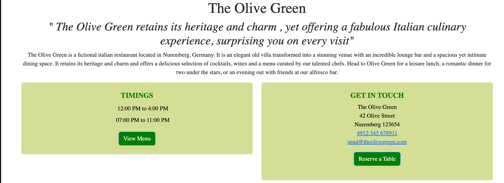

# The-Olive-Green
Project-portfolio-4

The Olive Green is a fictional Italian Restaurant located in Nuremberg, Bavaria, Germany. The appp is a restaurant management system designed to allow staff to easily manage the menus and bookings. It also provides customers to make online bookings where they can make their table reservations. The live link can be found here: [Live Site- The Olive Green](https://the-olive-green-c9c6086e4cc3.herokuapp.com/).

[MockUp]()

## Table of Contents

# User Experience Design

## The Strategy Plane

### Site Goals
The site is aimed at helping restaurant staff to easily manage the menus displayed on the website, as welll as keep track of upcoming bookings, editing and deleting as and when necessary. The site also aims to provide customers with a simple, hassle free way to make reservations, without the need to call the restaurant.

### Agile Planning
This project was developed using agile methodologies by delivering small features in incremental steps. The project was assigned to epics, prioritized under the labels, 'Musrt-have', 'Should-have', and 'Could-have'.
Must-have user stories were completed first, then "Should-haves" and finally "Could-haves". It was done this way to ensure that all major requirements were completed first to give the project a complete feel, and then later nice to have features can be added if there is availabilty of time and capacity.

The Kanban board was created using github projects and can be located [here](https://github.com/users/Niraja85/projects/6) and can be viewed to see more information on project cards. All stories except the documentation tasks have a full set of acceptance criteria in order to define that functionality that marks that story as complete.

#### Epics

The project had 8 manin Epics (milestones):

* EPIC 1 - Base Setup:

    * The base setup epic is for all stories needed for the base set up of the application. Without the base setup, the app would not be possible so it was the first epic to be delivered as all other features depend on the completion of the base setup.

* EPIC 2 - Stand alone pages:

    * The stand alone pages epic is for small pages that did not have enough stories to warrant their own full epics. Instead of creating epics for tiny features, these small deliverables were all added under this epic.

* EPIC 3 - Authentication Epic:

    * The authentication epic is for all stories related to the registration, login and authorization of views. This epic provides critical functionality and value as without it the staff would not be able to manage the bookings securely without regular site visitors also being able to see and perform actions.

* EPIC 4 - Menu:

    * The menu epic is for all stories that relate to the creating, deleting, editing and viewing of menus. This allows for regular users to view menus and for staff to manage them with a simple UI interface.

* EPIC 5 - Booking:

    * The booking epic is for all stories that relate to creating, viewing, updating and deleting bookings. This allows the staff to easily view upcoming bookings, manage the bookings and also for customers to book and manage their own reservations.

* EPIC 6 - Feedback:

    * The Feedback is for providing a rating system so that customers can rate their dining experience, which in turn will help improve the restaurant's service quality and help provide other customers to choose the reaturant for dining.

* EPIC 7 - Deployment Epic:

    * This epic is for all stories related to deploying the app to heroku so that the site is live for staff and customer use.

* EPIC 8 - Documentation:

    * This epic is for all document related stories and tasks that are needed to document the software development lifecycle of the application. It aims to deliver quality documentation, explaining all stages of development and necessary information on running, deploying and using the application.

#### User Stories

The following user stories were completed (by epics):

* Epic 1 - Base Setup:

    * As a developer, I need to create the base.html page and structure so that other pages can use that layout.
    * As a developer, I need to create static resources so that images, css and javascript work on the website.
    * As a developer, I need to set up the project so that it is ready for implementing the core features.
    * As a developer, I need to create the footer with social media links and contact information.
    * As a developer, I need to create the navbar so that users can navigate the website from any device.

* Epic 2 - Stand alone pages:

    * As a developer, I need to implement a 404 error page to alert users when they have accessed a page that doesn't exist.
    * As a developer, I need to implement a 500 error page to alert users when an internal server error occurs.
    * As a developer, I need to implement a 403 error page to redirect unauthorised users to so that I can secure my views.
    * As a restaurant owner, I would like a home page so that customers can view information on my restaurant.

* Epic 3 - Authentication Epic:

    * As a developer, I need to implement allauth so that users can sign up and have access to the websites features.
    * As a Site Owner, I want users to verify their email when registering an account so that I can ensure that a valid email address is being used.
    * As a site owner, I would like the allauth pages customized to that they fit in with the sites styling.

* Epic 4 - Menu:

    * As a staff user, I want to be able to create a new menu when we have new dishes to offer.
    * As a user, I would like to be able to view menus so that I can decide if I would like to dine at the restaurant.
    * As a staff user, I want to be able to edit a menu when updates are needed.
    * As a staff member, I would like to receive feedback when I create or update menus so that I can see they have worked.
    * As a staff user, I want to be able to delete a menu when it is no longer used.

* Epic 5 - Booking:

    * As a user, I would like to be able to create a new booking when I want to visit the restaurant.
    * As a user, I would like to view my bookings when I need to check the information.
    * As a user, I would like to be able to edit a booking so that I can make changes when needed.
    * As a user, I would like to receive feedback when I create a booking or edit one so I know it was completed successfully.
    * As a staff user, I want to be able to search a booking by reference to save time searching.
    * As a user I would like to delete a booking when I no longer require it.

* Epic 6 - Feedback:

    * As a user, I would like to be able to give a feedback about my dining experience in a star rating format, so that it helps other users choose the restaurant and helps the restaurant owner improve the service.

* Epic 7 - Deployment:

    * As a developer, I need to set up whitenoise so that my static files are served in deployment.
    * As a developer, I need to deploy the project to heroku so that it is live for customers.

* Epic 8 - Documentation:

    * Tasks:
        * Complete readme documentation.
        * Complete testing documentation writeup.

## The Scope Plane

* Responsive Design - Site should be fully functional on all devices from 320px up.
* Hamburger menu for mobile devices.
* Ability to perform CRUD functionality on Menus and Bookings.
* Restricted role based features.
* Home page with restaurant information.

## The Structure Plane

### Features

``USER STORY- As a developer, I need to create the navbar so that users can navigate the website from any device``

Implementation:

**Navigation Menu**

The Navigation contains links for Home, Menu, Bookings and has allauth options.

 The following navigation items are available on all pages:
  * Home -> index.html - Visible to all
  * Bookings (Drop Down):
    * Create Booking -> bookings.html - Visible to logged in users
    * Upcoming BookingS -> manage_bookings.html - Visible to logged in users
    * Past BookingS -> past_bookings.html - Visible to logged in users
    * All Bookings(Admin) --> admin_manage_bookings.html - visible to admin only
  * Menus (Drop Down):
    * View Menus -> menu.html - Visible to all
    * Create Menu -> create_menu.html - Visible to staff
    * Create Menu Item -> create_menu_items.html - Visible to staff
    * Manage Menu -> manage_menu.html - Visible to staff
  * Feedback

  * Login -> login.html - Visible to logged out users
  * Register -> signup.html - Visible to logged out users
  * Logout -> logout.html - Visible to logged in users

The navigation menu is displayed on all pages and drops down into a hamburger menu on smaller devices. This will allow users to view the site from any device and not take up too much space on mobile devices.

`` USER STORY- As a restaurant owner I would like to have a restaurant home page, so that customers can view information about my restaurant``

Implementation:

**Home Page**

The home page contains a hero image of the restaurant and information about the restaurant at the top of the page. This will immediately make it evident to the user, what the purpose of the website is.
Under the information section, the opening hours of the restaurant and address with contact details is given, which will allow the user to locate the restaurant and operating times. and there are two buttons, 'View Menu' and 'Reserve a table'. These buttons will allow the user a quick way to navigate to the respective pages if they wish to view menu or make a booking.

``USER STORY- As a developer, I need to create the footer to add the social media links, so that th ecustomer can follow us``

Implementation:

**Footer**

A footer has been added to the bottom of the site, this contains a X, Instagram and Facebook link so that users can follow the restaurant on social media if they want to keep up to date with special offers not advertised on the website. These icons have aria-labels added to ensure users with assistive screen reading technology know what the purpose of the links are for. They also open in new tabs as they lead users away from the site.

