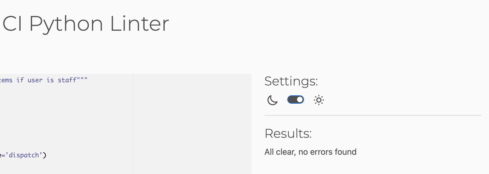

## Functional Testing

**Authentication**

Description:

Ensure a user can sign up to the website

Steps:

1. Navigate to [The Olive Green](https://the-olive-green-c9c6086e4cc3.herokuapp.com/) and click Register
2. Enter email, username and password
3. Click Sign up

Expected:

An email is recieved with a link to sign up, upon clicking the link, registration is successful

Actual:

An email is recieved with a link to sign up, upon clicking the link, registration is successful.

Description:

Ensure a user can log in once signed up

Steps:
1. Navigate to [The Olive Green](https://the-olive-green-c9c6086e4cc3.herokuapp.com/)
2. Enter login detailscreated in previous test case
3. Click login

Expected:

User is successfully logged in and redirected to the home page

Actual:

User is successfully logged in and redirected to the home page.

Description:

Ensure a user can sign out

Steps:

1. Login to the website
2. Click the logout button
3. Click confirm on the confirm logout page

Expected:

User is logged out.

Actual:

User is logged out.

**Booking Forms**

Description:

Ensure a new booking can be created.

Steps:

1. Navigate to [page](https://the-olive-green-c9c6086e4cc3.herokuapp.com/booking/) - Login is required first.
2. Enter the following:
    - Your Name: check
    - Your Email: check@example.com
    - Your Mobile: mobile number
    - No Of People: 3
    - Date: Any future date in the format (mm/dd/yy)
    - Time: Any drop down field
    -Any message: any message for guest
3. Click Send

Expected:

Form successfully submits and alert is shown to the user of successful booking.

Actual:

Form successfully submits and a alert is shown to the user of successful booking.

Description:

Ensure a booking can be edited.

Steps:

1. Navigate to [page](https://the-olive-green-c9c6086e4cc3.herokuapp.com/booking/edit/12/).
2. Enter the following:
    - Your Name: check
    - Your Email: check@example.com
    - Your Mobile: mobile number
    - No Of People: 3
    - Date: Any future date in the format (mm/dd/yy)
    - Time: Any drop down field
    -Any message: any message for guest
3. Click Update

Expected:

Form successfully submits and a message is shown to alert the user of updated booking.

Actual:

Form successfully submits and a message is shown to alert the user of updated booking.

Description:

Ensure user can successfully delete a booking.

Steps:
1. Login as a user with a booking or create a new booking
2. Click the Upcoming Booking nav link dropdown
3. Click the delete button on a booking
4. Click the confirm button on the delete page

Expected:

Booking is successfully deleted

Actual:

Booking is successfully deleted

**Menu Pages**

Description:

Ensure a new menu item can be added

Steps:

1. Navigate to the create menu item page from the Admin menu drop down nav item
2. Enter the following details:
    - Menu: Menu1
    - Title: item name
    - Category: Starter
    - Description: Test Item
    - Price: 15.00

3. Click Save.

Expected:

New menu item is sucessfully added and can be added to a new menu

Actual:

New menu item is sucessfully added and can be added to a new menu

Description:

Ensure a new menu can be created

Steps:

1. Sign in as a staff user
2. Select the Create Menu in the Menu drop down nav bar
3. Enter the follow details:
    - Name: Test Menu
    - Active checkbox: By default active
4. Click Create Menu

Expected:

New menu is created and can be viewed on the Create menu item page

Actual:

New menu is created and can be viewed on the Create menu item page

escription:

Ensure a menu can be updated

Steps:

1. Navigate to the manage mennus page from the menus drop down nav link
2. Click edit on a menu
3. Update a menu item and submit the form

Expected:

Menu has been updated and a message displayed to the user it was updated

Actual:

Menu has been updated and a message displayed to the user it was updated

Description:

Ensure a menu can be deleted

Steps:

1. Navigate to the manage menus page from the menus drop down nav link
2. Click the delete button on a menu
3. On the delete confirmation page click confirm

Expected:

Menu has been deleted and cannot be seen on the menu page

Actual:

Menu has been deleted and cannot be seen on the menu page

**Navigation Links**

Testing was performed to ensure all navigation links on the respective pages, navigated to the correct pages as per design. This was done by clicking on the navigation links on each page.

- Home -> index.html
- Bookings Drop Down, Create Booking -> booking.html
- Bookings Drop Down, Upcoming Bookings -> manage_booking.html
- Menus Drop Down, View Menu -> menu.html
- Admin Menu Drop Down, Create Menu -> create_menu.html
- Admin Menus Drop Down, Create Menu Item => create_menu_item.html
- Admin Menu Drop Down, Manage Menu -> manage_menu.html
- Logout -> Sign out all auth page
- Login -> Sign in all auth page
- Register -> Sign up all auth page

All navigation links directed to the corect pages as expected.

**Footer**

Testing was performed on the footer links by clicking the font awesome icons and ensuring that the facebook icon opened facebook in a new tab and the twitter icon opened twitter in a new tab. These behaved as expected.

## Negative Testing

Tests were performed on the create booking to ensure that:

1. A customer cannot book a date in the past
2. Forms cannot be submitted when required fields are empty.

## Unit Testing

Due to time constraints, automated testing was not implemented. However, extensive manual testing was performed across key user journeys such as booking reservations, navigating the menu, user authentication, and error handling to ensure reliable functionality and smooth user experience.

## Accessibility

[Wave Accessibility](https://wave.webaim.org/) tool was used throughout development and for final testing of the deployed website to check for any aid accessibility testing.

Testing was focused to ensure the following criteria were met:

- All forms have associated labels or aria-labels so that this is read out on a screen reader to users who tab to form inputs
- Color contrasts meet a minimum ratio as specified in [WCAG 2.1 Contrast Guidelines](https://www.w3.org/WAI/WCAG21/Understanding/contrast-minimum.html)
- Heading levels on home page were skipped so as to keep the font-size reduced. All the other pages'
headings were not missed or skipped.
- All content is contained within landmarks to ensure ease of use for assistive technology, allowing the user to navigate by page regions
- All not textual content had alternative text or titles so descriptions are read out to screen readers
- HTML page lang attribute has been set
- Aria properties have been implemented correctly
- WCAG 2.1 Coding best practices being followed.

## Validator Testing

All pages were run through the [w3 HTML Validator](https://validator.w3.org/). Initially there were some errors due to stray script tags, misuse of headings within spans and some unclosed elements. All of these issues were corrected and all pages passed validation.

Due to the django templating language code used in the HTML files, these could not be copy and pasted into the validator and due to the secured views, pages with login required or a secured view cannot be validated by direct URI. To test the validation on the files, open the page to validate, right click and view page source. Paste the raw html code into the validator as this will be only the HTML rendered code.

All pages were run through the official [Pep8ci](https://pep8ci.herokuapp.com/) validator to ensure all code was pep8 compliant. There are no errors found. All the line too long problems were fixed.

JavaScript code was run through [JSHINT](https://jshint.com) javascript validator.

CSS code was run through [W3C](https://jigsaw.w3.org/) CSS validator.

## Lighthouse Report

## Responsiveness

All pages were tested to ensure responsiveness on screen sizes from 320px and upwards as defined in WCAG 2.1 Reflow criteria for responsive design on Chrome, Edge, Firefox and Opera browsers.

Steps to test:

- Open browser and navigate to [The Olive Green](https://the-olive-green-c9c6086e4cc3.herokuapp.com/)
- Open the developer tools (right click and inspect)
- Set to responsive and decrease width to 320px
- Set the zoom to 50%
-  Click and drag the responsive window to maximum width

Expected:

Website is responsive on all screen sizes and no images are pixelated or stretched. No horizontal scroll is present. No elements overlap.

Actual:

Website behaved as expected.

## Bugs

* Anonymous users were able to view others bookings.
    - Fixed:
        - LoginRequiredMixins was added in the wrong order in Bookings views.py, So the correct order for all Booking views are to add LoginRequiredMixin first, then ListView, CreateView, UpdateView, and DeleteView as required.

        - To further strengthen the security, added dispatch function in Bookings update and delete views which works as follows:
            - Admin can view, edit and delete all bookings.
            - Non-logged in users cannot view or manage bookings and will be directed to login page.
            - Logged in users can view, and manage their own bookings only.
            - Logged in users cannot view or manage others bookings.

* Password Reset form threw 500 error:
    - Fixed:
        - In settings.py in Account setup, Account Email Verification was set to mandatory. And Email_Host User and Email_Host_password was created using Gmail smtp account setup.

* Booking Form was taking past dates and invalid inputs:
    - Fixed:
        -  In Booking form widget had been added but it had an s missing. Added that. Also Validation error set for min.number of guests to be 1, if not an error will be raised.
        - Also def _init_ was wrongly indented which led to date time errors. Corrected indentation.

* Menu prices were showing negative values:
    - Fixed:
        - Widgets was added in MenuItemForm in forms.py to keep price min. value to 0 and increase in step of 0.01. Also if price goes < 0 then a validation error will be raised to reject negative values.

